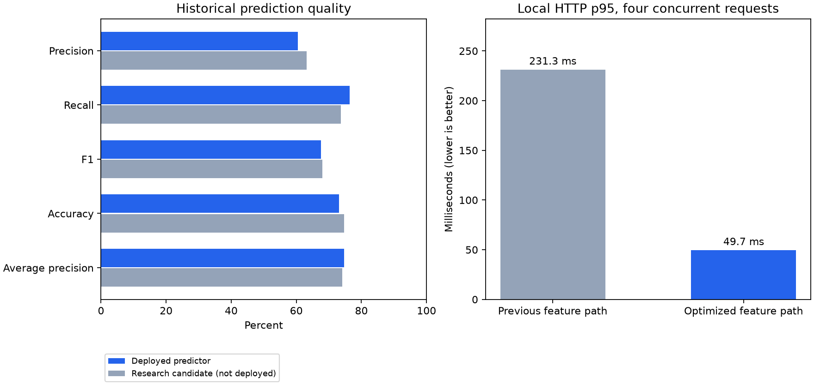

# ML exploration and service optimization — 27 September 2026

**Deployed:** faster inference with the existing `refined_24h:1ff6245ac77b553e` predictor. **Not deployed:** the newly trained accuracy/precision candidate, because it failed the predeclared replacement criteria.

## Deployed performance improvement

The service previously built rolling feature matrices for every historical hour, although it scored only the last row. The optimized path computes only the current snapshot. The immutable training feature module and trained weights remain unchanged. All 1,000 sampled development snapshots produced exactly identical model probabilities (maximum difference 0). Short histories, missing values, gaps and all feature columns are covered by parity tests.

| Paired local HTTP measurement | Previous path | Optimized path |
|---|---:|---:|
| Serial median | 17.25 ms | 6.37 ms |
| Serial p95 | 34.72 ms | 7.04 ms |
| Four concurrent requests, median | 191.77 ms | 32.41 ms |
| Four concurrent requests, p95 | 231.35 ms | 49.65 ms |
| Four-client throughput | 20.7 requests/s | 117.8 requests/s |

Throughput improved 5.69×. Both paths used the same Docker container, model and three real historical object payloads, after training finished. Each path received five warmups, 90 serial requests and 120 requests at concurrency four. Probabilities matched exactly. This is a local, fixed-order microbenchmark; infrastructure, order and cache effects remain possible. It excludes PostgreSQL aggregation, queue wait and client network latency and does not certify the production SLA. The temporary comparison server was stopped afterwards.

## Prediction-quality results

The best development candidate added four-week alarm history and weekly analogues, removed mixed sensor numeric features, used CatBoost depth 8 / 332 trees, and selected isotonic calibration on a separate month. The final comparison used exactly the same 171,485 historical snapshots as the current predictor.

| Metric | Deployed predictor | Candidate |
|---|---:|---:|
| Precision | 0.60520 | 0.63121 |
| Recall | 0.76427 | 0.73683 |
| F1 | 0.67549 | 0.67994 |
| Accuracy | 0.73161 | 0.74646 |
| Average precision | 0.74688 | 0.74116 |
| ROC-AUC | 0.82036 | 0.82276 |
| Brier score (lower is better) | 0.16128 | 0.16022 |

F1 gain: 0.44 percentage points; 95% paired weekly bootstrap interval [0.11, 0.75] points (1,000 resamples). This is a modest trade-off, not a significant all-round improvement. Candidate false positives fell from 31,250 to 26,983, but false negatives increased from 14,775 to 16,495. The candidate was retained only as a research artifact.

The promotion rule was registered before benchmark inference: at least +0.01 F1 and +0.01 average precision, no precision/accuracy regression exceeding 0.005, and a positive lower confidence bound for F1 improvement. The candidate failed this rule. No threshold or model was retuned after viewing the benchmark.

**Evidence limit:** this historical period had already been examined in earlier work. It is a regression benchmark, not fresh unseen evidence. Weekly blocks account for some temporal correlation, but not all longer dependencies or model-selection uncertainty. Confirmed incident performance cannot be inferred from alarm-proxy labels.

## Search coverage

Twenty configurations (including the v2 control), 29 development training fits and equal-weight ensemble comparisons were completed. The search covered:

- CatBoost depths 6/8/10, categorical one-hot encoding, ordered time processing, class weighting, two-year training and recency decay.
- LightGBM 31/63/127 leaves, XGBoost depths 6/8 and a regularized linear probability model.
- Seven-day versus four-week history, weekly analogues, historical alarm-day frequency and object/calendar interactions.
- Ablations excluding mixed sensor measurements, and a calendar-only baseline.
- Temperature-specific measurements, distinct alarm channels, and gas/electrical/ventilation/door/motion alarm categories. Raw archives from 2019–2026 were aggregated without changing the original files.
- Equal-weight ensembles of the strongest development models.
- Identity, sigmoid, isotonic and object-adjusted sigmoid calibration with three regularization strengths; a separately fitted F1 threshold.

This is a broad practical search, not an exhaustive search over every possible model. Large neural sequence models and external weather/work-history enrichment were not implemented: they require further validation and, for enrichment, reliable linked inputs. No claim of a global accuracy maximum is made.

## Leakage controls

Every development fold has separate training, early-stopping, operating-threshold and scoring periods, with 25-hour gaps between them. Fold 1: train before July 2023; stopping July–August; threshold September; scoring October–December. Fold 2: train before April 2024; stopping April–May; threshold June; scoring July–September. All cutoffs apply the 25-hour embargo. Seventeen initial configurations were screened on fold 1; five finalists plus control were checked on fold 2. Three sensor-specific configurations were evaluated on both folds as a documented pre-benchmark extension. Final training ends before October 2024; calibration fit October–November, selection December, operating threshold January–May 2025. Feature tests perturb later telemetry and verify earlier rows stay unchanged. Weekly analogues use only already observed periods.

| Finalist | Mean development F1 | Mean development AP |
|---|---:|---:|
| v3_no_numeric | 0.67287 | 0.74800 |
| ensemble | 0.67235 | 0.74908 |
| v3_d6 | 0.67199 | 0.74847 |
| v3_temporal | 0.67185 | 0.74832 |
| xgb8 | 0.67158 | 0.74915 |
| xgb6 | 0.67156 | 0.74843 |
| typed_d8 | 0.67032 | 0.74736 |
| typed_lgb63 | 0.66904 | 0.74415 |
| typed_d6 | 0.66779 | 0.74812 |
| v2_control | 0.66619 | 0.74211 |

## Data-quality findings requiring resolution

The source audit covered all 31,937,125 rows in 2023 and 49,023,883 rows in 2024. Neither year contained invalid timestamps or unrecognized alarm flags. The 2023 archive contained **562,449 exact duplicate rows** and **226,852 event IDs referring to different records** (789,301 surplus rows when grouping solely by ID). The 2024 archive had no duplicate event IDs. There were 21,164 rows in 2023 and 5,257 in 2024 whose channels were absent from the supplied channel registry.

No conflicting records were guessed away or silently relabeled. Original aggregations are retained for comparable experiments. Before importing the 2023 archive, resolve the source event-ID namespace: the application expects stable unique event IDs and treats repeated IDs as duplicates. An authoritative source-qualified key or correction table is needed to preserve distinct conflicting records. Exact duplicate rows can be removed in a separately validated rebuild; counts in current training retain them. The unknown channels need registry mappings. These audit findings were not extrapolated to uninspected years.

For a meaningful next accuracy improvement, supply confirmed incident start/end times and types, verified false alarms, sensor-state meanings, corrected identifiers and new observations beyond June 2026. These enable trustworthy labels and a genuinely future evaluation. Threshold preference should reflect the operational cost of missed alarms versus false alerts.

## Verification and reproduction

Thirteen Python tests passed. The isolated application suite passed real-model inference, retries, idempotency, imports and role checks, dispatcher outcomes, 20 concurrent readers and 20 SSE clients. Observed small-fixture inference was 23 ms; it is not a production benchmark.

Training workspace: `D:/Files/Moskouu/ml-moscollector`. Reproducible scripts: `scripts/explore_model.py`, `build_typed_hourly.py`, `explore_typed.py`, `finalize_exploration.py`, `check_fast_parity.py`, `benchmark_feature_paths.py`, `audit_source.py`, `audit_duplicates.py`. Use the existing `.venv/Scripts/python.exe`. The final script refuses to overwrite the existing benchmark evaluation. Reports, protocols, every trial, predictions, source audits, environment versions and latency measurements are in `reports/exploration_20260927/`. The undeployed research bundle is `models/explored_20260927/`; its component manifest is consumed by the research scripts, not the current production loader. Deploying it would require an explicit serving integration and a revised acceptance decision; do not point MODEL_DIR at it.

The deployed feature optimization is `ml-service/fast_features.py`. For emergency comparison or rollback, set `ML_BATCH_FEATURES=1` in the root `.env`, then recreate the ML container as described in [Operations](OPERATIONS.md) to use the original batch implementation. The normal default is the fast path; no database migration, model-weight change or frontend rebuild is required.

Method references: [CatBoost parameters](https://catboost.ai/docs/en/references/training-parameters/common), [LightGBM tuning](https://github.com/lightgbm-org/LightGBM/blob/main/docs/Parameters-Tuning.rst), [XGBoost GPU training](https://xgboost.readthedocs.io/en/stable/gpu/), [scikit-learn threshold tuning](https://scikit-learn.org/stable/modules/classification_threshold.html).
