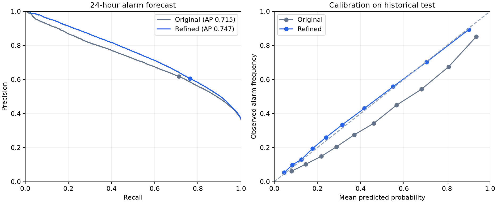

# Model refinement — 26 September 2026

Status: activated locally as `refined_24h:1ff6245ac77b553e`. Original weights are preserved for rollback. See [Operations](OPERATIONS.md) for activation and rollback commands.

The objective is balanced precision and recall (F1) for any alarm in the next 24 hours. These are alarm-proxy labels, not independently verified physical incidents. No claim of maximum possible accuracy is made.

## Measured comparison

The unchanged original model and candidate were evaluated on the same 171,485 object-hour snapshots from 2025-05-15 18:00:00 to 2026-06-29 23:00:00 (Moscow wall time). This period had already been reported for the original model; it is not a newly unseen dataset. Candidate settings, calibration and operating threshold were frozen before this comparison.

| Metric | Original | Refined |
|---|---:|---:|
| Accuracy | 0.7339 | 0.7316 |
| Precision | 0.6181 | 0.6052 |
| Recall | 0.7118 | 0.7643 |
| F1 | 0.6617 | 0.6755 |
| Average precision / PR-AUC | 0.7149 | 0.7469 |
| ROC-AUC | 0.8028 | 0.8204 |
| Brier score (lower is better) | 0.1792 | 0.1613 |

Paired F1 improvement: +0.0138; 95% weekly block bootstrap interval [+0.0104, +0.0175] (300 replicates). Weekly resampling preserves within-week dependence across objects; longer dependencies and selection uncertainty are not fully represented.

Original confusion matrix [TN, FP; FN, TP]: [[81247, 27560], [18064, 44614]]. Refined: [[77557, 31250], [14775, 47903]].

Persistence rule (alarm in the preceding 24 hours): F1 0.5832.

## Changes and selection

- Shared causal training/inference features: 1, 3, 6, 12, 24, 72 and 168-hour history; alarm categories, recency, activity, trends and cyclic calendar features.
- Six CatBoost configurations compared on two chronological development periods; depths 6–10, class weights and recent-history training. Mean development F1 selects the configuration, with AP as a tie-breaker.
- A 25-hour embargo separates partitions, exceeding the 24-hour outcome window. No random split of overlapping snapshots.
- Calibration fit: October–November 2024; identity, sigmoid and isotonic selection: December 2024 by Brier score. Operating threshold: January 2025 to the embargo before 15 May 2025. No test-set threshold optimization.
- PostgreSQL produces hourly aggregates for inference, avoiding transfer of a week of raw telemetry. Model weights, feature-code hash, calibration and metadata provide version provenance.

Selected configuration: `{'name': 'd10_regularized', 'depth': 10, 'l2_leaf_reg': 15, 'learning_rate': 0.035}`; 434 trees, GPU, random seed 2026. Calibration: sigmoid. Operating threshold: 30.380%. GPU training may not be bitwise reproducible.

| Configuration | Development F1 | Development AP |
|---|---:|---:|
| d10_regularized | 0.6740 | 0.7540 |
| d8_sqrt | 0.6737 | 0.7534 |
| d8_balanced | 0.6723 | 0.7527 |
| d7_recent | 0.6722 | 0.7542 |
| d8_unweighted | 0.6718 | 0.7535 |
| d6_unweighted | 0.6715 | 0.7528 |

## Verification

All seven Python tests passed against the deployed bundle, including causal features, offline/online parity and real HTTP inference. Server compilation, client lint and production build passed. The isolated PostgreSQL integration suite passed real inference (48 ms on a small fixture), failed-request retry, idempotency, dispatcher outcomes, 20 concurrent readers and 20 SSE connections. These measurements are not production load certification.

## Reproduction and evidence

Training workspace: `D:/Files/Moskouu/ml-moscollector`. Run `.venv/Scripts/python.exe scripts/refine_model.py --stage search --engine GPU`, then `--stage final --engine GPU`. The final stage refuses to overwrite an existing final evaluation. An independent future evaluation requires a newly registered protocol and new outcomes, not deleting this safeguard.

Candidate bundle: `models/refined_20260926/`. Evidence: `reports/refinement_20260926/` contains the protocol, all development runs, selection, paired test predictions, feature importance and per-quarter/per-object results. Original models and datasets are preserved. Cached features are version-specific; do not reuse the cache after changing their definitions.

## Limits and missing data

Confirmed incident types, start times and dispatcher outcomes are still required to optimize physical incident prediction. Missing source events are treated as no alarms in historical labeling; this does not prove healthy equipment. Seven-day features need seven days of supplied telemetry for full context; the local review database currently contains only approximately one day. Online partial-hour buckets differ from completed training buckets and require prospective validation. Numeric sensor aggregates pool different sensor types; the internal `temperature_change_6h` feature is a pooled numeric change, not a physical temperature measurement. Thresholds need an agreed operational false-alarm/missed-alarm cost and prospective review.

Method references: [CatBoost classification metrics](https://catboost.ai/docs/en/concepts/loss-functions-classification) and [scikit-learn calibration guidance](https://scikit-learn.org/stable/modules/generated/sklearn.calibration.CalibratedClassifierCV.html).
